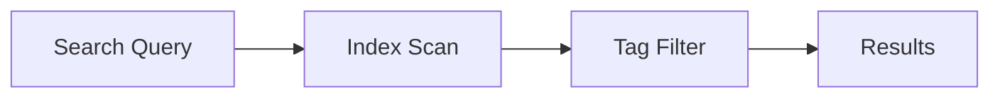

## Overview

Sotatek provides a comprehensive platform for managing project documentation. You organize content into folders, collaborate in real-time, track changes with version history, and find information quickly using search and tags. These features streamline your workflow from initial setup to ongoing maintenance.

<Columns cols={2}>
  <Card title="Project Organization" icon="folder" href="#project-organization">
    Structure your docs with intuitive folders and nesting.
  </Card>
  <Card title="Editing & Collaboration" icon="edit-3" href="#editing-collaboration">
    Edit markdown files together with live previews.
  </Card>
  <Card title="Version History" icon="git-branch" href="#version-history">
    Track revisions and revert changes easily.
  </Card>
  <Card title="Search & Tagging" icon="search" href="#search-tagging">
    Locate content fast with advanced search tools.
  </Card>
</Columns>

## Project Organization and Folders

Create a hierarchical structure to keep your documentation scalable. Start by setting up a root project folder, then add subfolders for guides, APIs, and changelogs.

<Steps>
  <Step title="Create Project" icon="plus">
    Navigate to your dashboard and click "New Project". Enter a name like "MyApp Docs".
  </Step>
  <Step title="Add Folders" icon="folder-plus">
    Inside the project, create folders: right-click and select "New Folder".
  </Step>
  <Step title="Nest Documents" icon="file-text">
    Drag MDX files into subfolders. Use the tree view for navigation.
  </Step>
</Steps>

<Callout kind="tip">
  Limit nesting to three levels deep to maintain usability.
</Callout>

Example folder structure:

````json
{
  "projects": {
    "MyApp": {
      "quickstart.mdx": {},
      "guides/": {
        "authentication.mdx": {},
        "features.mdx": {}
      }
    }
  }
}
````

## Document Editing and Collaboration

Edit documents collaboratively with real-time updates. Sotatek supports MDX syntax, including components like `<Callout>` and code blocks.

<Tabs>
  <Tab title="Solo Edit" icon="edit">
    Open any `.mdx` file. Use the split-pane view for markdown source and live preview.
  </Tab>
  <Tab title="Team Edit" icon="users">
    Share the doc link. Multiple users see changes instantly. Resolve conflicts via inline comments.
  </Tab>
</Tabs>

<CodeGroup tabs="MDX,Markdown">
  ```mdx
  ## Welcome

  <Callout kind="info">
    This updates live for all collaborators.
  </Callout>
  ```
  ```markdown
  ## Welcome

  > This updates live for all collaborators.
  ```
</CodeGroup>

## Version History and Revisions

Every edit creates a commit. View diffs, restore previous versions, or branch for experiments.

<Expandable title="View History" default-open="true">
  Right-click a file > "Version History". Select a commit to compare:

  | Revision | Author | Date | Changes |
  |----------|--------|------|---------|
  | v1.2     | you@example.com | 2024-10-15 | +Auth section |
  | v1.1     | team@company.com | 2024-10-10 | Fix typos |
  | v1.0     | you@example.com | 2024-10-01 | Initial draft |
</Expandable>

Revert with one click: `<kbd>Cmd</kbd>+<kbd>Z</kbd>` or select "Restore".

## Search Functionality and Tagging

Search across all projects with full-text indexing. Add tags for filtering.

<Steps>
  <Step title="Add Tags" icon="tag">
    In file settings, add tags like `api`, `guide`.
  </Step>
  <Step title="Search" icon="search">
    Use the global search bar: "authentication api".
  </Step>
  <Step title="Filter Results" icon="filter">
    Toggle tags or folders to refine.
  </Step>
</Steps>



<Callout kind="info">
  Tags sync across teams. Use consistent naming like `v1.0`, `beta`.
</Callout>